# Bueno Dashboard

Personal dashboard that aggregates data from Spotify, Steam/CS2, GPS location tracking, and more.

---

## Quick Start

```bash
# 1. Clone and install
git clone <repo-url>
cd bueno
npm install

# 2. Set up environment
cp .env.local.example .env.local   # or create from scratch (see Environment Variables below)

# 3. Start Convex backend (separate terminal)
npx convex dev

# 4. Run the app (client + server concurrently)
npm run dev
```

The Vite dev server runs on `http://localhost:5173` with API requests proxied to the Hono server on `http://localhost:3000`.

### Production — Single Service (API + Frontend)

The server serves both the API and the built frontend static files.

| | |
|---|---|
| Root | `/` |
| Build | `npm run build` |
| Start | `npm run start` |

### Production — Separate Services (Frontend + Backend)

Deploy the backend to any Node.js host and the frontend to any static host.

**Backend (API only)**

| | |
|---|---|
| Root | `/` |
| Build | `npm run build:server` |
| Start | `npm run start:server` |
| Env | `VITE_API_URL` set to frontend origin for CORS |

**Frontend (static files)**

| | |
|---|---|
| Root | `/` |
| Build | `npm run build` |
| Start | `npx serve dist/static -l $PORT -s` |
| Env | `VITE_API_URL` set to backend origin |

---

## Table of Contents

1. [Overview](about:blank#overview)
2. [Technology Stack](about:blank#technology-stack)
3. [Feature Summary](about:blank#feature-summary)
4. [Architecture Diagrams by Service](about:blank#architecture-diagrams-by-service)
    - [Spotify Integration](about:blank#1-spotify-integration)
    - [Steam Profile & CS Stats](about:blank#2-steam-profile--cs-stats)
    - [CS2 Match History & Demo Downloads](about:blank#3-cs2-match-history--demo-downloads)
    - [Location Service](about:blank#4-location-service)
    - [Lucky Numbers](about:blank#5-lucky-numbers)
    - [Authentication & User Management](about:blank#6-authentication--user-management)
    - [Dashboard Data Flow](about:blank#7-dashboard-data-flow-overview)
5. [Sequence Diagrams](about:blank#sequence-diagrams)
6. [State Diagrams](about:blank#state-diagrams)
7. [Communication Diagrams](about:blank#communication-diagrams)
8. [Class/Component Diagrams](about:blank#classcomponent-diagrams)
9. [Activity Diagrams](about:blank#activity-diagrams)
10. [Error Handling](about:blank#error-handling)
11. [Security Architecture](about:blank#security-architecture)

---

## Overview

**Bueno Dashboard** is a personal dashboard application that aggregates data from multiple external services into a single, unified interface. It displays:

- **Spotify**: Currently playing track, top artists, genres, and recently played songs
- **Steam**: Recent games and CS2 statistics (kills, deaths, wins, playtime)
- **CS2 Match History**: Match share codes and demo download links for replay analysis
- **Location Tracking**: GPS location history from external devices (e.g., iOS Shortcuts)
- **Lucky Numbers**: Random number generator for lottery games (Mega-Sena, Quina)

The application uses a **decoupled architecture**:
- **Vite + React SPA** handles the frontend UI with TanStack Router for client-side routing. Deployable to any static host.
- **Hono (Node.js)** serves the API layer, including Steam GC connections and OAuth callbacks. Deployable to any Docker/Node host.
- **Convex** serves as the primary backend for real-time data, authentication, database operations, and scheduled jobs.

This split exists because some operations (like Steam Game Coordinator connections) require persistent sockets and Node.js-specific libraries that Convex’s serverless environment cannot support.

---

## Technology Stack

| Layer | Technology | Purpose |
| --- | --- | --- |
| **Frontend** | Vite + React 19 + TanStack Router | SPA, client-side routing |
| **Styling** | Tailwind CSS v4 + shadcn/ui | Utility-first CSS, component primitives |
| **Authentication** | Clerk | OAuth providers, session management, JWT tokens |
| **Backend (Database)** | Convex | Real-time database, queries, mutations, actions, cron jobs |
| **Backend (API Server)** | Hono (Node.js) | Steam GC connections, OAuth callbacks |
| **Maps** | Leaflet + OpenStreetMap | Client-side map rendering and geocoding |
| **Package Manager** | npm | Dependency management |
| **External APIs** | Spotify, Steam Web API, Steam GC | Third-party data sources |

---

## Feature Summary

| Feature | Client | API Server (Hono) | Convex | External API |
| --- | --- | --- | --- | --- |
| **Spotify OAuth** | Initiates redirect to Spotify | Receives callback, triggers Convex action | Exchanges code for tokens, saves refresh token | Spotify OAuth |
| **Spotify Data (cached)** | Displays artists, genres, tracks via `useQuery` | — | Cron refreshes every 10 min, stores in `spotifyData` | Spotify `/me/top/artists`, `/me/player/recently-played` |
| **Spotify Now Playing** | Polls every 10s via `useAction` | — | Action fetches current track on-demand | Spotify `/me/player/currently-playing` |
| **Steam Data** | Displays games, CS2 stats via `useQuery` | — | Cron refreshes every 1 hour, stores in `steamData` | Steam `GetRecentlyPlayedGames`, `GetUserStatsForGame` |
| **CS2 Share Codes** | Triggers fetch via `useAction` | — | Action loops `GetNextMatchSharingCode` until exhausted | Steam Web API |
| **CS2 Demo URLs** | Sends share codes via `fetch()` | Logs into Steam GC, requests match data + metadata | — | Steam Game Coordinator (binary protocol) |
| **CS2 Demo Archiving** | Manual trigger via button | — | Cron archives every 30 min, action downloads from Valve and uploads to S3 | Valve CDN, AWS S3 |
| **Location** | Renders Leaflet map, displays history | Receives POST from external devices, calls mutation | Stores in `locations`, queries with permission check | OpenStreetMap tiles + Nominatim geocoding |
| **Lucky Numbers** | Generates via `Math.random()`, displays in UI | — | — | — |
| **Auth** | Clerk `<SignIn/>` component, `ConvexClientProvider` | — | Creates/updates user on login, manages permissions | Clerk |

---

## Architecture Diagrams by Service

### 1. Spotify Integration

```mermaid
flowchart TB
    subgraph client [Client Browser]
        AdminUI[Admin Page<br/>Connect Button]
        Dashboard[Dashboard<br/>Artists, Genres,<br/>Recent, Now Playing]
    end

    subgraph api [API Server (Hono)]
        Callback[GET /api/spotify-callback]
    end

    subgraph convex [Convex]
        subgraph cron [Scheduled Jobs]
            SpotifyCron[refreshSpotifyData<br/>Every 10 min]
        end
        subgraph actions [Actions]
            ExchangeToken[exchangeSpotifyCodeForToken]
            GetCurrent[getCurrentlyPlayingTrack]
        end
        subgraph data [Data Layer]
            SpotifyQueries[getSpotifyData<br/>getUserSpotifyData]
            SpotifyMutations[storeSpotifyData<br/>saveSpotifyRefreshTokenInternal]
            SpotifyDB[(spotifyData<br/>websiteSettings)]
        end
    end

    subgraph spotify [Spotify API]
        OAuth[authorize endpoint]
        TokenAPI[api/token endpoint]
        TopArtists[me/top/artists]
        RecentlyPlayed[me/player/recently-played]
        CurrentlyPlaying[me/player/currently-playing]
    end

    AdminUI -->|1. Redirect| OAuth
    OAuth -->|2. code param| Callback
    Callback -->|3. action call| ExchangeToken
    ExchangeToken -->|4. POST code + secret| TokenAPI
    TokenAPI -->|5. access + refresh tokens| ExchangeToken
    ExchangeToken -->|6. internal mutation| SpotifyMutations

    SpotifyCron --> TopArtists
    SpotifyCron --> RecentlyPlayed
    SpotifyCron --> SpotifyMutations

    Dashboard -->|useQuery| SpotifyQueries
    Dashboard -->|useAction poll| GetCurrent
    GetCurrent --> CurrentlyPlaying

    SpotifyQueries --> SpotifyDB
    SpotifyMutations --> SpotifyDB
```

**Key Points:**

- OAuth tokens are exchanged and stored entirely within Convex (never exposed to client)
- Refresh token is stored in `websiteSettings` table, linked to user
- Cron job runs every 10 minutes to refresh cached artist/genre/track data
- “Currently Playing” cannot be cached (real-time state), so it’s polled live via action

---

### 2. Steam Profile & CS Stats

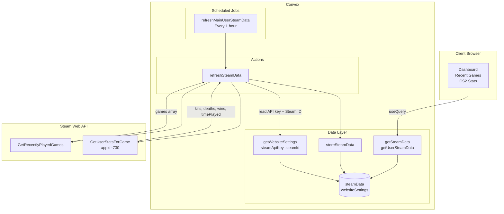
```mermaid
flowchart TB
    subgraph client [Client Browser]
        Dashboard[Dashboard<br/>Recent Games<br/>CS2 Stats]
    end

    subgraph convex [Convex]
        subgraph cron [Scheduled Jobs]
            SteamCron[refreshMainUserSteamData<br/>Every 1 hour]
        end
        subgraph actions [Actions]
            RefreshSteam[refreshSteamData]
        end
        subgraph data [Data Layer]
            SteamQueries[getSteamData<br/>getUserSteamData]
            SteamMutations[storeSteamData]
            Settings[getWebsiteSettings<br/>steamApiKey, steamId]
            SteamDB[(steamData<br/>websiteSettings)]
        end
    end

    subgraph steam [Steam Web API]
        RecentGames[GetRecentlyPlayedGames]
        UserStats[GetUserStatsForGame<br/>appid=730]
    end

    SteamCron --> RefreshSteam
    RefreshSteam -->|read API key + Steam ID| Settings
    RefreshSteam --> RecentGames
    RefreshSteam --> UserStats
    RecentGames -->|games array| RefreshSteam
    UserStats -->|kills, deaths, wins, timePlayed| RefreshSteam
    RefreshSteam --> SteamMutations

    Dashboard -->|useQuery| SteamQueries
    SteamQueries --> SteamDB
    SteamMutations --> SteamDB
    Settings --> SteamDB
```

**Key Points:**

- Steam API key is stored in `websiteSettings` table (server-side only)
- Cron job refreshes every hour (Steam data changes infrequently)
- CS2 stats (appid 730) are fetched only if CS2 appears in recent games
- Dashboard reads from cached `steamData` table (no direct API calls from client)

---

### 3. CS2 Match History & Demo Downloads

```mermaid
flowchart TB
    subgraph client [Client Browser]
        AdminUI[Admin Page<br/>Match History UI]
        SettingsUI[Settings Page<br/>Share Code + Auth Token]
    end

    subgraph api [API Server (Hono)]
        DownloadAPI[GET /api/cs/download]
        MatchesAPI[GET /api/cs/matches]
        EnvVars[Environment Variables<br/>STEAM_USERNAME<br/>STEAM_PASSWORD]
    end

    subgraph convex [Convex]
        subgraph actions [Actions]
            FetchCodes[fetchMatchShareCodes]
        end
        subgraph data [Data Layer]
            SaveMatches[saveMatchResults]
            GetMatches[getMyMatches]
            SaveSettings[saveCs2Settings]
            CS2DB[(cs2Matches<br/>websiteSettings)]
        end
    end

    subgraph steam [Steam Services]
        WebAPI[Steam Web API<br/>GetNextMatchSharingCode]
        GC[Steam Game Coordinator<br/>Binary Protocol]
    end

    SettingsUI -->|useMutation| SaveSettings
    SaveSettings --> CS2DB

    AdminUI -->|1. useAction| FetchCodes
    FetchCodes -->|2. loop until n/a| WebAPI
    WebAPI -->|3. share codes| FetchCodes
    FetchCodes -->|4. return codes array| AdminUI

    AdminUI -->|5. fetch with codes| MatchesAPI
    MatchesAPI -->|read credentials| EnvVars
    MatchesAPI -->|6. login + requestGame| GC
    GC -->|7. matchList with demo URLs| MatchesAPI
    MatchesAPI -->|8. return matches| AdminUI

    AdminUI -->|9. useMutation| SaveMatches
    SaveMatches --> CS2DB

    AdminUI -->|useQuery| GetMatches
    GetMatches --> CS2DB
```

**Key Points:**

- **Two-phase architecture**: Share codes via Convex action (Web API), Demo URLs via Hono API route (GC)
- Steam GC requires persistent socket connection + Node.js `steam-user` library (not available in Convex)
- User provides their own `lastShareCode` + `authToken` via Settings page
- Steam login credentials (username/password/2FA secret) are server-side environment variables only
- Matches are stored in `cs2Matches` table with index on `shareCode` for deduplication

---

### 4. Location Service

```mermaid
flowchart TB
    subgraph external [External Sources]
        Device[iOS Shortcut<br/>or other automation]
    end

    subgraph client [Client Browser]
        LocationPage[Location Page<br/>Map + History Table]
    end

    subgraph api [API Server (Hono)]
        LocationAPI[POST /api/location]
    end

    subgraph convex [Convex]
        subgraph data [Data Layer]
            AddLocation[addLocation mutation]
            GetHistory[getLocationHistory query]
            PermCheck[Permission check:<br/>owner or relatives]
            LocationDB[(locations)]
        end
    end

    subgraph maps [Map Services]
        Leaflet[Leaflet.js<br/>Client-side rendering]
        OSM[OpenStreetMap<br/>Tiles + Nominatim API]
    end

    Device -->|POST lat, lng, displayName| LocationAPI
    LocationAPI -->|mutation call| AddLocation
    AddLocation --> LocationDB

    LocationPage -->|useQuery| GetHistory
    GetHistory --> PermCheck
    PermCheck -->|if authorized| LocationDB
    LocationPage --> Leaflet
    Leaflet -->|tile requests| OSM
    LocationPage -->|search/geocode| OSM
```

**Key Points:**

- External devices (iOS Shortcuts, Tasker, etc.) POST location data to Hono API endpoint
- Location viewing requires `owner` or `relatives` permission (privacy protection)
- Map is rendered client-side with Leaflet (no server-side map generation)
- Location records include optional fields: altitude, street, city, state, zip, region

---

### 5. Lucky Numbers

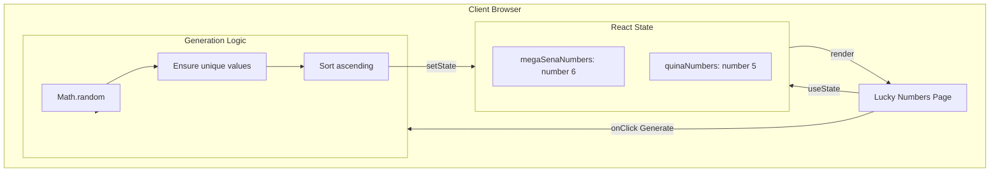
```mermaid
flowchart TB
    subgraph client [Client Browser]
        LuckyPage[Lucky Numbers Page]

        subgraph state [React State]
            MegaSena[megaSenaNumbers: number 6]
            Quina[quinaNumbers: number 5]
        end

        subgraph logic [Generation Logic]
            Random[Math.random]
            Sort[Sort ascending]
            Unique[Ensure unique values]
        end
    end

    LuckyPage -->|useState| state
    LuckyPage -->|onClick Generate| logic
    logic --> Random
    Random --> Unique
    Unique --> Sort
    Sort -->|setState| state
    state -->|render| LuckyPage
```

**Key Points:**

- 100% client-side implementation
- No backend calls, no database storage
- Mega-Sena: 6 unique numbers from 1-60
- Quina: 5 unique numbers from 1-80
- Instant generation with `Math.random()`

---

### 6. Authentication & User Management

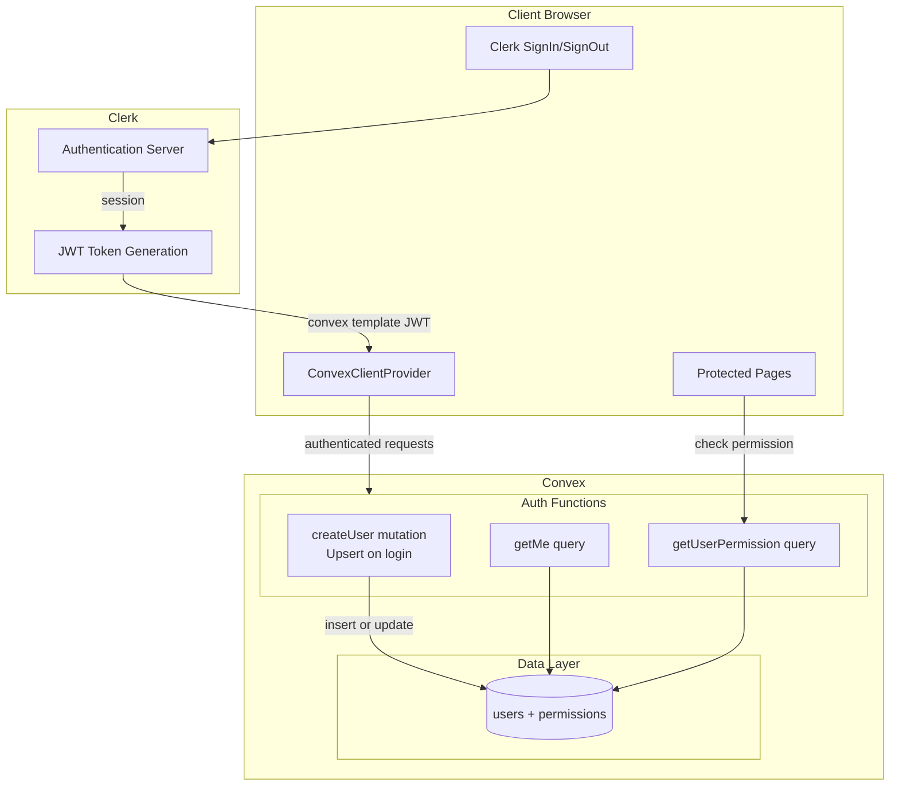
```mermaid
flowchart TB
    subgraph client [Client Browser]
        ClerkUI[Clerk SignIn/SignOut]
        ConvexProvider[ConvexClientProvider]
        ProtectedPages[Protected Pages]
    end

    subgraph clerk [Clerk]
        ClerkAuth[Authentication Server]
        JWT[JWT Token Generation]
    end

    subgraph convex [Convex]
        subgraph auth [Auth Functions]
            CreateUser[createUser mutation<br/>Upsert on login]
            GetMe[getMe query]
            GetPermission[getUserPermission query]
        end
        subgraph authdata [Data Layer]
            AuthDB[(users + permissions)]
        end
    end

    ClerkUI --> ClerkAuth
    ClerkAuth -->|session| JWT
    JWT -->|convex template JWT| ConvexProvider
    ConvexProvider -->|authenticated requests| auth

    CreateUser -->|insert or update| AuthDB
    GetMe --> AuthDB
    GetPermission --> AuthDB

    ProtectedPages -->|check permission| GetPermission
```

**Permission Levels:**

| Role | Access Level | Use Cases |
| --- | --- | --- |
| `viewer` | Read-only access to public data | Default for new users |
| `editor` | Can create/edit content | Content contributors |
| `admin` | System administration | Manage settings, view all data |
| `owner` | Full control, used by cron jobs | Primary account owner (typically 1 user) |
| `relatives` | Location history access only | Family members who can view location |

**Permission Enforcement:**
- Queries check `ctx.auth.getUserIdentity()` for authentication
- Role-based access uses `getUserPermission` query internally
- Cron jobs use `getOwnerUserId` to identify whose data to refresh

---

### 7. Dashboard Data Flow Overview

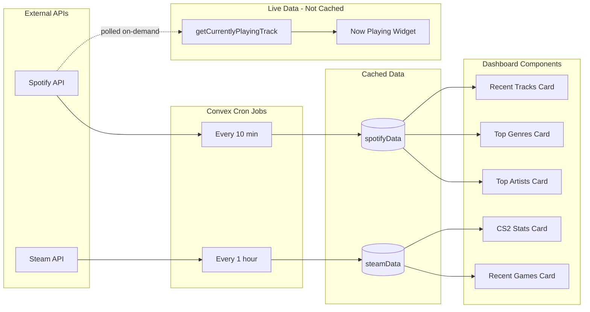
```mermaid
flowchart LR
    subgraph sources [External APIs]
        SpotifyAPI[Spotify API]
        SteamAPI[Steam API]
    end

    subgraph crons [Convex Cron Jobs]
        SpotifyCron[Every 10 min]
        SteamCron[Every 1 hour]
    end

    subgraph cache [Cached Data]
        SpotifyData[(spotifyData)]
        SteamData[(steamData)]
    end

    subgraph dashboard [Dashboard Components]
        RecentGames[Recent Games Card]
        CSStats[CS2 Stats Card]
        TopArtists[Top Artists Card]
        TopGenres[Top Genres Card]
        RecentTracks[Recent Tracks Card]
    end

    subgraph live [Live Data - Not Cached]
        CurrentTrack[getCurrentlyPlayingTrack]
        NowPlaying[Now Playing Widget]
    end

    SpotifyAPI --> SpotifyCron
    SteamAPI --> SteamCron
    SpotifyCron --> SpotifyData
    SteamCron --> SteamData

    SpotifyData --> TopArtists
    SpotifyData --> TopGenres
    SpotifyData --> RecentTracks
    SteamData --> RecentGames
    SteamData --> CSStats

    SpotifyAPI -.->|polled on-demand| CurrentTrack
    CurrentTrack --> NowPlaying
```

**Key Points:**

- **Cached data** (solid lines): Pre-fetched by cron jobs, instant load via `useQuery`
- **Live data** (dashed line): Polled on-demand, cannot be cached (track changes in real-time)
- Dashboard uses owner’s data as fallback if current user has no connected services

---

## Sequence Diagrams

### Spotify OAuth Connection

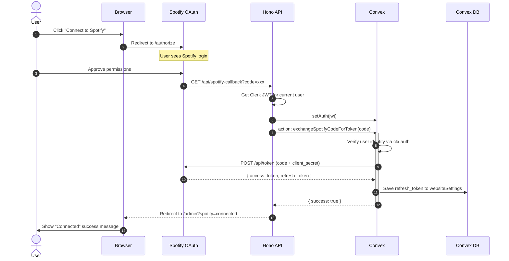
```mermaid
sequenceDiagram
    autonumber
    actor User
    participant Browser
    participant Spotify as Spotify OAuth
    participant Hono as Hono API
    participant Convex
    participant DB as Convex DB

    User->>Browser: Click "Connect to Spotify"
    Browser->>Spotify: Redirect to /authorize
    Note over Spotify: User sees Spotify login

    User->>Spotify: Approve permissions
    Spotify->>Hono: GET /api/spotify-callback?code=xxx

    Hono->>Hono: Get Clerk JWT for current user
    Hono->>Convex: setAuth(jwt)
    Hono->>Convex: action: exchangeSpotifyCodeForToken(code)

    activate Convex
    Convex->>Convex: Verify user identity via ctx.auth
    Convex->>Spotify: POST /api/token (code + client_secret)
    Spotify-->>Convex: { access_token, refresh_token }
    Convex->>DB: Save refresh_token to websiteSettings
    Convex-->>Hono: { success: true }
    deactivate Convex

    Hono-->>Browser: Redirect to /admin?spotify=connected
    Browser->>User: Show "Connected" success message
```

---

### Spotify Data Refresh (Cron Job)

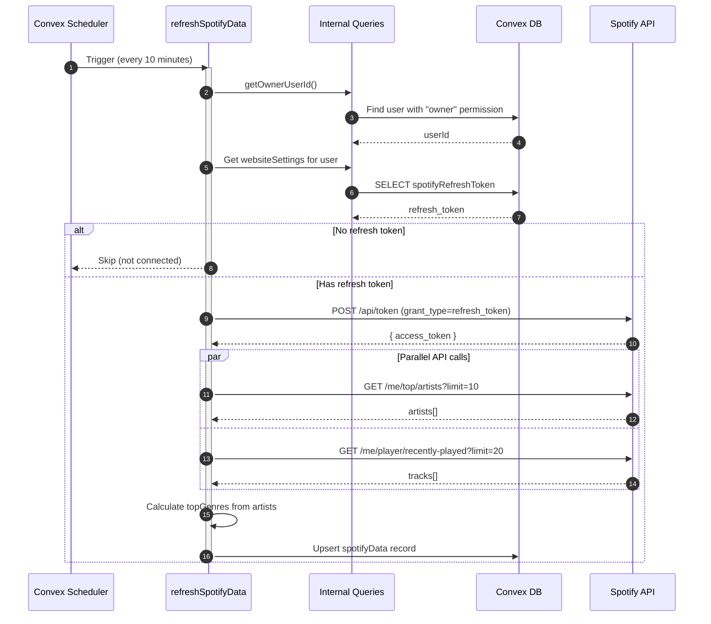
```mermaid
sequenceDiagram
    autonumber
    participant Cron as Convex Scheduler
    participant Action as refreshSpotifyData
    participant Query as Internal Queries
    participant DB as Convex DB
    participant Spotify as Spotify API

    Cron->>Action: Trigger (every 10 minutes)
    activate Action

    Action->>Query: getOwnerUserId()
    Query->>DB: Find user with "owner" permission
    DB-->>Query: userId

    Action->>Query: Get websiteSettings for user
    Query->>DB: SELECT spotifyRefreshToken
    DB-->>Query: refresh_token

    alt No refresh token
        Action-->>Cron: Skip (not connected)
    else Has refresh token
        Action->>Spotify: POST /api/token (grant_type=refresh_token)
        Spotify-->>Action: { access_token }

        par Parallel API calls
            Action->>Spotify: GET /me/top/artists?limit=10
            Spotify-->>Action: artists[]
        and
            Action->>Spotify: GET /me/player/recently-played?limit=20
            Spotify-->>Action: tracks[]
        end

        Action->>Action: Calculate topGenres from artists
        Action->>DB: Upsert spotifyData record
    end

    deactivate Action
```

---

### Currently Playing Track (Live Poll)

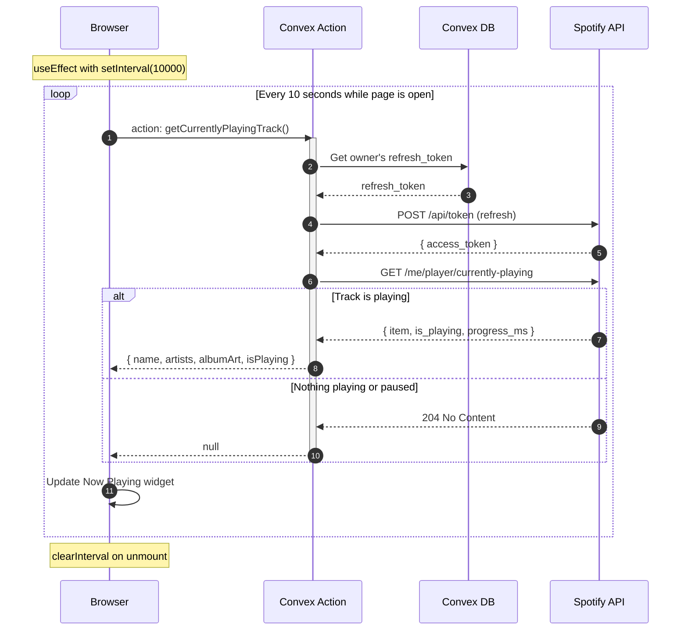
```mermaid
sequenceDiagram
    autonumber
    participant Browser
    participant Convex as Convex Action
    participant DB as Convex DB
    participant Spotify as Spotify API

    Note over Browser: useEffect with setInterval(10000)

    loop Every 10 seconds while page is open
        Browser->>Convex: action: getCurrentlyPlayingTrack()
        activate Convex

        Convex->>DB: Get owner's refresh_token
        DB-->>Convex: refresh_token

        Convex->>Spotify: POST /api/token (refresh)
        Spotify-->>Convex: { access_token }

        Convex->>Spotify: GET /me/player/currently-playing

        alt Track is playing
            Spotify-->>Convex: { item, is_playing, progress_ms }
            Convex-->>Browser: { name, artists, albumArt, isPlaying }
        else Nothing playing or paused
            Spotify-->>Convex: 204 No Content
            Convex-->>Browser: null
        end

        deactivate Convex

        Browser->>Browser: Update Now Playing widget
    end

    Note over Browser: clearInterval on unmount
```

---

### Steam Data Refresh (Cron Job)

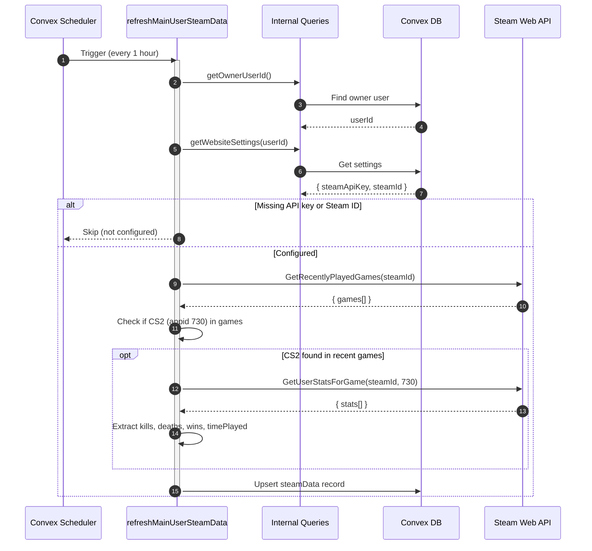
```mermaid
sequenceDiagram
    autonumber
    participant Cron as Convex Scheduler
    participant Action as refreshMainUserSteamData
    participant Query as Internal Queries
    participant DB as Convex DB
    participant Steam as Steam Web API

    Cron->>Action: Trigger (every 1 hour)
    activate Action

    Action->>Query: getOwnerUserId()
    Query->>DB: Find owner user
    DB-->>Query: userId

    Action->>Query: getWebsiteSettings(userId)
    Query->>DB: Get settings
    DB-->>Query: { steamApiKey, steamId }

    alt Missing API key or Steam ID
        Action-->>Cron: Skip (not configured)
    else Configured
        Action->>Steam: GetRecentlyPlayedGames(steamId)
        Steam-->>Action: { games[] }

        Action->>Action: Check if CS2 (appid 730) in games

        opt CS2 found in recent games
            Action->>Steam: GetUserStatsForGame(steamId, 730)
            Steam-->>Action: { stats[] }
            Action->>Action: Extract kills, deaths, wins, timePlayed
        end

        Action->>DB: Upsert steamData record
    end

    deactivate Action
```

---

### CS2 Match History Fetch

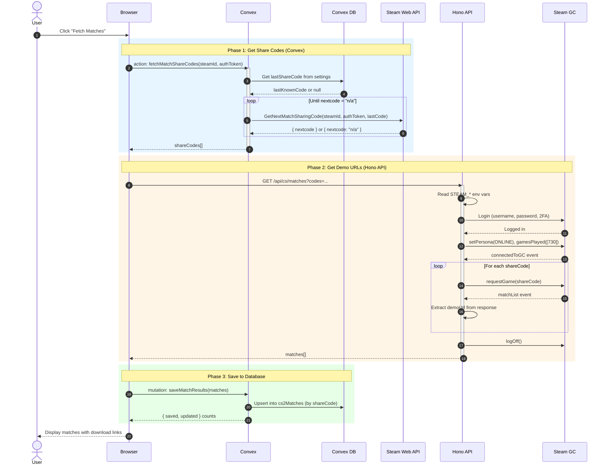
```mermaid
sequenceDiagram
    autonumber
    actor User
    participant Browser
    participant Convex
    participant DB as Convex DB
    participant SteamWeb as Steam Web API
    participant Hono as Hono API
    participant SteamGC as Steam GC

    User->>Browser: Click "Fetch Matches"

    rect rgb(230, 245, 255)
        Note over Browser,SteamWeb: Phase 1: Get Share Codes (Convex)
        Browser->>Convex: action: fetchMatchShareCodes(steamId, authToken)
        activate Convex

        Convex->>DB: Get lastShareCode from settings
        DB-->>Convex: lastKnownCode or null

        loop Until nextcode = "n/a"
            Convex->>SteamWeb: GetNextMatchSharingCode(steamId, authToken, lastCode)
            SteamWeb-->>Convex: { nextcode } or { nextcode: "n/a" }
        end

        Convex-->>Browser: shareCodes[]
        deactivate Convex
    end

    rect rgb(255, 245, 230)
        Note over Browser,SteamGC: Phase 2: Get Demo URLs (Hono API)
        Browser->>Hono: GET /api/cs/matches?codes=...
        activate Hono

        Hono->>Hono: Read STEAM_* env vars
        Hono->>SteamGC: Login (username, password, 2FA)
        SteamGC-->>Hono: Logged in

        Hono->>SteamGC: setPersona(ONLINE), gamesPlayed([730])
        SteamGC-->>Hono: connectedToGC event

        loop For each shareCode
            Hono->>SteamGC: requestGame(shareCode)
            SteamGC-->>Hono: matchList event
            Hono->>Hono: Extract demoUrl from response
        end

        Hono->>SteamGC: logOff()
        Hono-->>Browser: matches[]
        deactivate Hono
    end

    rect rgb(230, 255, 230)
        Note over Browser,DB: Phase 3: Save to Database
        Browser->>Convex: mutation: saveMatchResults(matches)
        Convex->>DB: Upsert into cs2Matches (by shareCode)
        Convex-->>Browser: { saved, updated } counts
    end

    Browser-->>User: Display matches with download links
```

---

### Location Update (External Device)

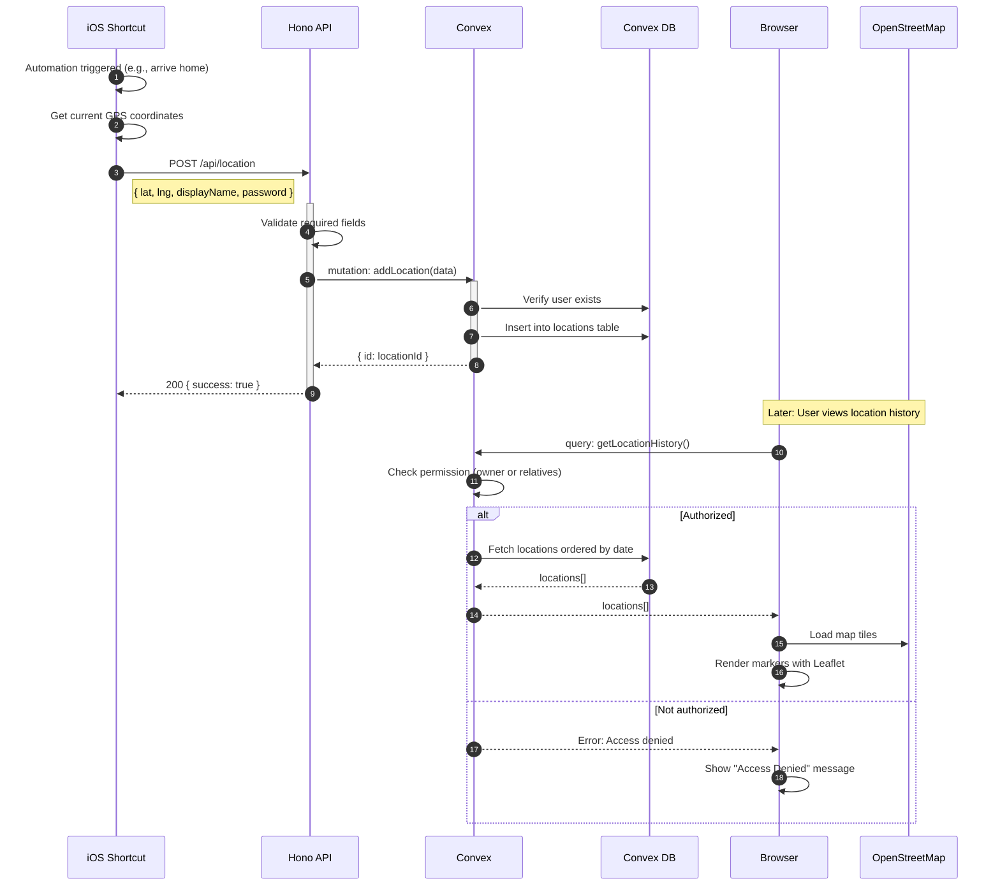
```mermaid
sequenceDiagram
    autonumber
    participant Device as iOS Shortcut
    participant Hono as Hono API
    participant Convex
    participant DB as Convex DB
    participant Browser
    participant OSM as OpenStreetMap

    Device->>Device: Automation triggered (e.g., arrive home)
    Device->>Device: Get current GPS coordinates

    Device->>Hono: POST /api/location
    Note right of Device: { lat, lng, displayName, password }

    activate Hono
    Hono->>Hono: Validate required fields
    Hono->>Convex: mutation: addLocation(data)

    activate Convex
    Convex->>DB: Verify user exists
    Convex->>DB: Insert into locations table
    Convex-->>Hono: { id: locationId }
    deactivate Convex

    Hono-->>Device: 200 { success: true }
    deactivate Hono

    Note over Browser,OSM: Later: User views location history

    Browser->>Convex: query: getLocationHistory()
    Convex->>Convex: Check permission (owner or relatives)

    alt Authorized
        Convex->>DB: Fetch locations ordered by date
        DB-->>Convex: locations[]
        Convex-->>Browser: locations[]

        Browser->>OSM: Load map tiles
        Browser->>Browser: Render markers with Leaflet
    else Not authorized
        Convex-->>Browser: Error: Access denied
        Browser->>Browser: Show "Access Denied" message
    end
```

---

## State Diagrams

### Spotify Connection State

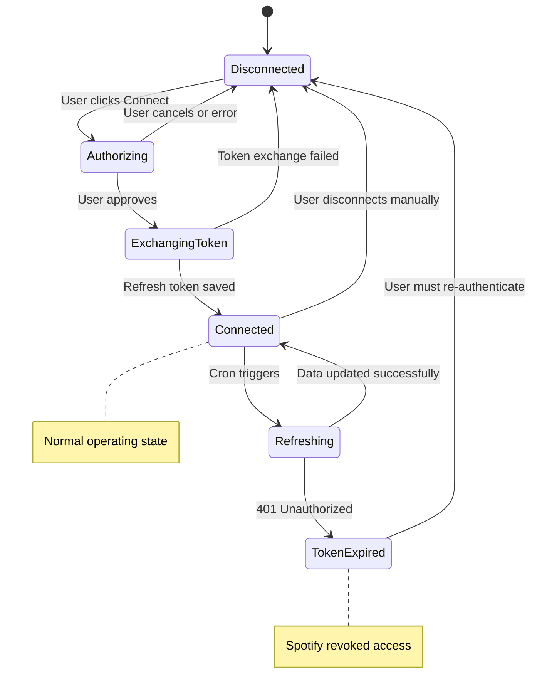
```mermaid
stateDiagram-v2
    [*] --> Disconnected

    Disconnected --> Authorizing: User clicks Connect
    Authorizing --> Disconnected: User cancels or error
    Authorizing --> ExchangingToken: User approves

    ExchangingToken --> Disconnected: Token exchange failed
    ExchangingToken --> Connected: Refresh token saved

    Connected --> Refreshing: Cron triggers
    Refreshing --> Connected: Data updated successfully
    Refreshing --> TokenExpired: 401 Unauthorized

    TokenExpired --> Disconnected: User must re-authenticate

    Connected --> Disconnected: User disconnects manually

    note right of Connected: Normal operating state
    note right of TokenExpired: Spotify revoked access
```

---

### CS2 Match Fetch State

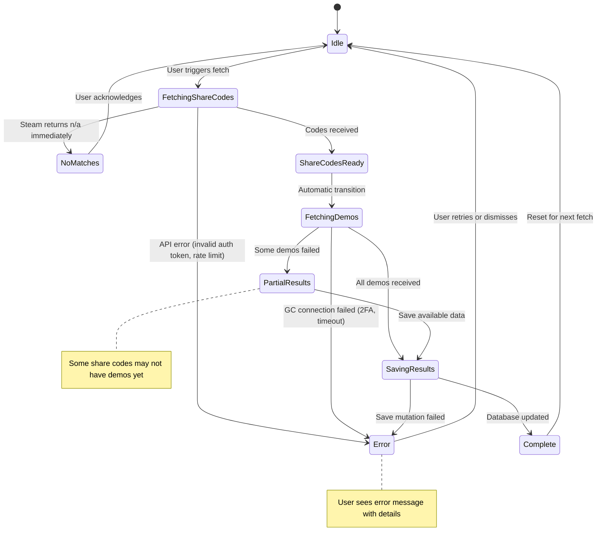
```mermaid
stateDiagram-v2
    [*] --> Idle

    Idle --> FetchingShareCodes: User triggers fetch

    FetchingShareCodes --> NoMatches: Steam returns n/a immediately
    FetchingShareCodes --> ShareCodesReady: Codes received
    FetchingShareCodes --> Error: API error (invalid auth token, rate limit)

    NoMatches --> Idle: User acknowledges
    Error --> Idle: User retries or dismisses

    ShareCodesReady --> FetchingDemos: Automatic transition

    FetchingDemos --> SavingResults: All demos received
    FetchingDemos --> PartialResults: Some demos failed
    FetchingDemos --> Error: GC connection failed (2FA, timeout)

    PartialResults --> SavingResults: Save available data

    SavingResults --> Complete: Database updated
    SavingResults --> Error: Save mutation failed

    Complete --> Idle: Reset for next fetch

    note right of Error: User sees error message with details
    note right of PartialResults: Some share codes may not have demos yet
```

---

### Steam GC Connection State

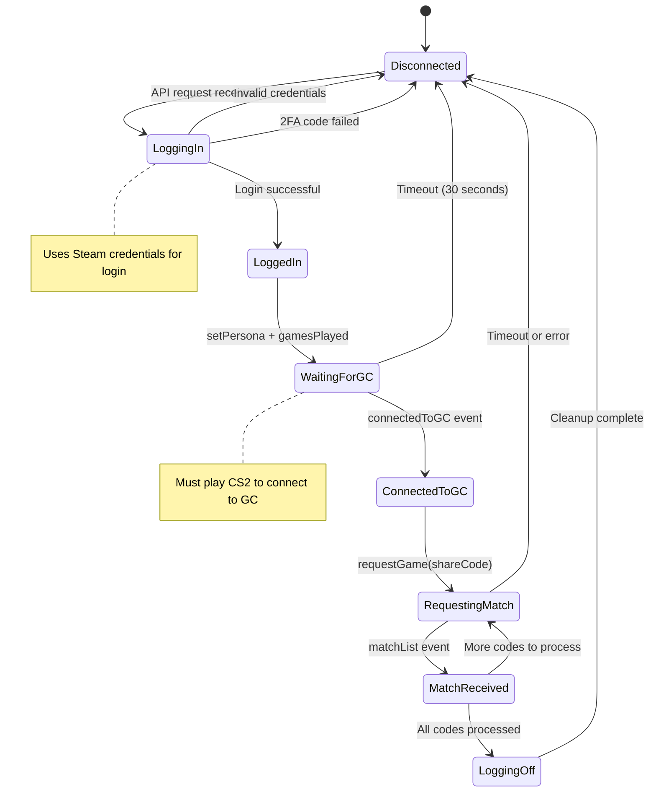
```mermaid
stateDiagram-v2
    [*] --> Disconnected

    Disconnected --> LoggingIn: API request received

    LoggingIn --> Disconnected: Invalid credentials
    LoggingIn --> Disconnected: 2FA code failed
    LoggingIn --> LoggedIn: Login successful

    LoggedIn --> WaitingForGC: setPersona + gamesPlayed

    WaitingForGC --> Disconnected: Timeout (30 seconds)
    WaitingForGC --> ConnectedToGC: connectedToGC event

    ConnectedToGC --> RequestingMatch: requestGame(shareCode)

    RequestingMatch --> MatchReceived: matchList event
    RequestingMatch --> Disconnected: Timeout or error

    MatchReceived --> RequestingMatch: More codes to process
    MatchReceived --> LoggingOff: All codes processed

    LoggingOff --> Disconnected: Cleanup complete

    note right of LoggingIn: Uses Steam credentials for login
    note right of WaitingForGC: Must play CS2 to connect to GC
```

---

### Location Page State

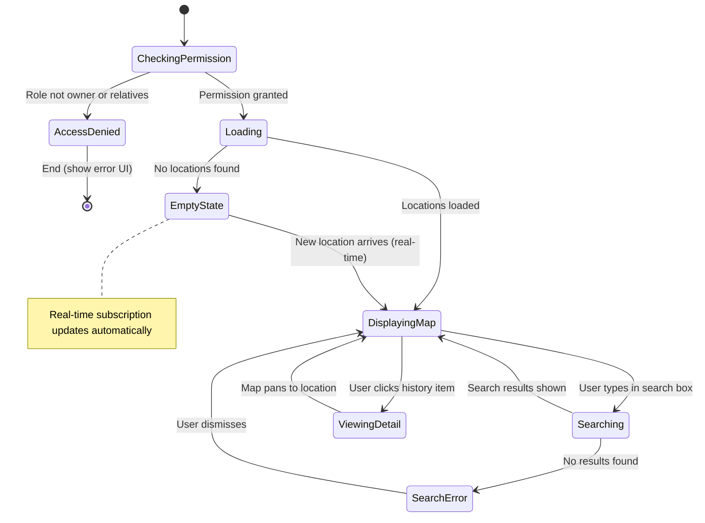
```mermaid
stateDiagram-v2
    [*] --> CheckingPermission

    CheckingPermission --> AccessDenied: Role not owner or relatives
    CheckingPermission --> Loading: Permission granted

    AccessDenied --> [*]: End (show error UI)

    Loading --> DisplayingMap: Locations loaded
    Loading --> EmptyState: No locations found

    EmptyState --> DisplayingMap: New location arrives (real-time)

    DisplayingMap --> Searching: User types in search box
    Searching --> DisplayingMap: Search results shown
    Searching --> SearchError: No results found
    SearchError --> DisplayingMap: User dismisses

    DisplayingMap --> ViewingDetail: User clicks history item
    ViewingDetail --> DisplayingMap: Map pans to location

    note right of EmptyState: Real-time subscription updates automatically
```

---

## Communication Diagrams

### System Communication Overview

```mermaid
flowchart TB
    subgraph Actors [External Actors]
        User([User])
        Device([External Device])
    end

    subgraph ClientLayer [Client Layer]
        Browser[React App]
    end

    subgraph ServerLayer [Server Layer]
        Hono[Hono API (Node.js)]
        Convex[Convex Backend]
    end

    subgraph DataLayer [Data Layer]
        DB[(Convex Database)]
    end

    subgraph ExternalLayer [External Services]
        Clerk[Clerk Auth]
        Spotify[Spotify API]
        SteamWeb[Steam Web API]
        SteamGC[Steam GC]
        OSM[OpenStreetMap]
    end

    User -->|interacts| Browser
    Device -->|POST location| Hono

    Browser <-->|queries, mutations, actions| Convex
    Browser -->|fetch demos| Hono
    Browser <-->|authentication| Clerk
    Browser -->|map tiles, geocoding| OSM
    Browser -->|OAuth redirect| Spotify

    Hono -->|mutations| Convex
    Hono <-->|GC protocol| SteamGC

    Convex -->|cron jobs| Convex
    Convex <-->|OAuth, data| Spotify
    Convex <-->|Web API| SteamWeb
    Convex <-->|read, write| DB
```

---

### Match Fetch Communication Flow

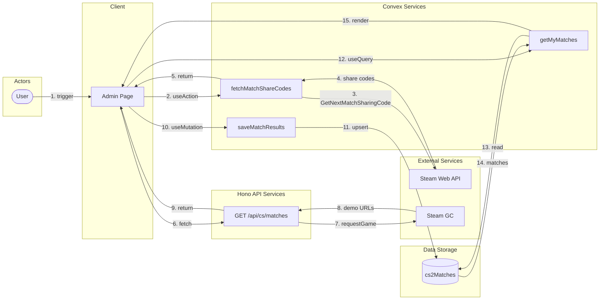
```mermaid
flowchart LR
    subgraph Actors
        User([User])
    end

    subgraph Client
        Admin[Admin Page]
    end

    subgraph ConvexSvc [Convex Services]
        FetchAction[fetchMatchShareCodes]
        SaveMutation[saveMatchResults]
        MatchQuery[getMyMatches]
    end

    subgraph HonoSvc [Hono API Services]
        MatchAPI[GET /api/cs/matches]
    end

    subgraph ExternalSvc [External Services]
        SteamWeb[Steam Web API]
        SteamGC[Steam GC]
    end

    subgraph Storage [Data Storage]
        DB[(cs2Matches)]
    end

    User -->|1. trigger| Admin
    Admin -->|2. useAction| FetchAction
    FetchAction -->|3. GetNextMatchSharingCode| SteamWeb
    SteamWeb -->|4. share codes| FetchAction
    FetchAction -->|5. return| Admin
    Admin -->|6. fetch| MatchAPI
    MatchAPI -->|7. requestGame| SteamGC
    SteamGC -->|8. demo URLs| MatchAPI
    MatchAPI -->|9. return| Admin
    Admin -->|10. useMutation| SaveMutation
    SaveMutation -->|11. upsert| DB
    Admin -->|12. useQuery| MatchQuery
    MatchQuery -->|13. read| DB
    DB -->|14. matches| MatchQuery
    MatchQuery -->|15. render| Admin
```

---

## Class/Component Diagrams

### Convex Data Model (Actual Schema)


```mermaid
classDiagram
    class users {
        +Id _id
        +string name
        +string email
        +string tokenIdentifier
        +string image [optional]
        +boolean onboardingComplete [optional]
    }

    class permissions {
        +Id _id
        +Id~users~ userId
        +string role
    }

    class websiteSettings {
        +Id _id
        +Id~users~ userId
        +string steamApiKey [optional]
        +string steamId [optional]
        +string spotifyRefreshToken [optional]
        +string locationApiPassword [optional]
        +string cs2SteamUsername [optional]
        +string cs2LastShareCode [optional]
        +string cs2ShareCodeAuthToken [optional]
    }

    class steamData {
        +Id _id
        +Id~users~ userId
        +Array~Game~ recentGames
        +Object csStats [optional]
        +number lastUpdated
    }

    class spotifyData {
        +Id _id
        +Id~users~ userId
        +Array~Artist~ topArtists
        +Array~Genre~ topGenres
        +Array~Track~ recentlyPlayedTracks [optional]
        +number lastUpdated
    }

    class locations {
        +Id _id
        +Id~users~ userId
        +string url
        +string insertedDate
        +number latitude
        +number longitude
        +string displayName
        +number altitude [optional]
        +string street [optional]
        +string city [optional]
        +string state [optional]
        +string zip [optional]
        +string region [optional]
    }

    class cs2Matches {
        +Id _id
        +Id~users~ userId
        +string steamId
        +string shareCode
        +string demoUrl [optional]
        +string matchId [optional]
        +string matchTime [optional]
        +number fetchedAt
        +string s3ObjectKey [optional]
        +Array~number~ teamScores [optional]
        +number matchResult [optional]
        +number targetPlayerTeam [optional]
        +Object playerStats [optional]
    }

    class cs2Demos {
        +Id _id
        +string fileId
        +any parsedJson
        +number createdAt
        +number updatedAt [optional]
    }

    class privateNotes {
        +Id _id
        +Id~users~ userId
        +string title
        +string content
        +number createdAt
        +number updatedAt
        +string accessLevel
    }

    class tasks {
        +Id _id
        +string text
        +boolean isCompleted
        +number createdAt [optional]
        +Id~users~ userId [optional]
    }

    users "1" --> "0..1" permissions : has role
    users "1" --> "0..1" websiteSettings : has settings
    users "1" --> "0..1" steamData : has steam data
    users "1" --> "0..1" spotifyData : has spotify data
    users "1" --> "*" locations : has locations
    users "1" --> "*" cs2Matches : has matches
    users "1" --> "*" privateNotes : has notes
    users "1" --> "*" tasks : has tasks
```

---

### Component Architecture

```mermaid
classDiagram
    class ViteApp {
        +ConvexClientProvider
        +ClerkProvider
        +TanStack Router
        +src/routes/
    }

    class Routes {
        +index.tsx (Dashboard)
        +admin.tsx
        +settings.tsx
        +location.tsx
        +lucky-numbers.tsx
        +match.tsx
        +editor.tsx
    }

    class APIRoutes {
        +GET /api/spotify-callback
        +GET /api/cs/download
        +GET /api/cs/matches
        +POST /api/cs/archive
        +POST /api/location
        +GET /api/cs
    }

    class ConvexFunctions {
        +Queries
        +Mutations
        +Actions
        +InternalActions
        +Crons
    }

    class Queries {
        +getSteamData()
        +getSpotifyData()
        +getLocationHistory()
        +getMyMatches()
        +getMyCs2Settings()
        +getUserPermission()
    }

    class Mutations {
        +addLocation()
        +saveMatchResults()
        +saveCs2Settings()
        +saveWebsiteSettings()
        +createUser()
    }

    class Actions {
        +exchangeSpotifyCodeForToken()
        +getCurrentlyPlayingTrack()
        +fetchMatchShareCodes()
        +triggerSpotifyRefresh()
        +triggerDemoArchive()
    }

    class InternalActions {
        +refreshSpotifyData()
        +refreshMainUserSteamData()
        +downloadPendingDemos()
        +getOwnerUserId()
    }

    class HonoServer {
        +serves Vite static build
        +proxies API calls
        +Steam GC connections
        +OAuth callbacks
    }

    ViteApp --> Routes
    ViteApp --> HonoServer : serves static build
    Routes --> ConvexFunctions : useQuery, useMutation, useAction
    HonoServer --> ConvexFunctions : ConvexHttpClient calls
    HonoServer --> APIRoutes : handles HTTP routes
    ConvexFunctions --> Queries
    ConvexFunctions --> Mutations
    ConvexFunctions --> Actions
    ConvexFunctions --> InternalActions
```

---

### External Service Integration Patterns

```mermaid
classDiagram
    class SpotifyIntegration {
        <<OAuth 2.0 + REST>>
        +exchangeCodeForToken(code)
        +refreshAccessToken(refreshToken)
        +getTopArtists(accessToken)
        +getRecentlyPlayed(accessToken)
        +getCurrentlyPlaying(accessToken)
    }

    class SteamWebAPIIntegration {
        <<REST API>>
        +getRecentlyPlayedGames(steamId)
        +getUserStatsForGame(steamId, appId)
        +resolveVanityURL(vanityUrl)
        +getNextMatchSharingCode(steamId, authToken, lastCode)
    }

    class SteamGCIntegration {
        <<Binary Protocol>>
        +login(username, password, sharedSecret)
        +setPersona(status)
        +gamesPlayed(appIds)
        +requestGame(shareCode)
        +logOff()
    }

    class OpenStreetMapIntegration {
        <<REST API>>
        +search(query)
        +reverseGeocode(lat, lng)
        +getTiles(z, x, y)
    }

    class ClerkIntegration {
        <<OAuth 2.0>>
        +signIn()
        +signOut()
        +getToken(template)
        +getUserIdentity()
    }

    note for SpotifyIntegration "Handled in Convex actions"
    note for SteamWebAPIIntegration "Handled in Convex actions"
    note for SteamGCIntegration "Handled in Hono API routes"
    note for OpenStreetMapIntegration "Called directly from browser"
    note for ClerkIntegration "Client-side + JWT to Convex"
```

---

## Activity Diagrams

### Dashboard Load Flow

```mermaid
flowchart TD
    Start([Page Load]) --> CheckAuth{User authenticated?}

    CheckAuth -->|No| LoadPublicData[Load owner's public data]
    CheckAuth -->|Yes| UpsertUser[Create or update user record]

    UpsertUser --> GetOwner[Get owner user ID]
    LoadPublicData --> GetOwner

    GetOwner --> ParallelFetch

    subgraph ParallelFetch [Parallel Data Queries]
        direction LR
        FetchSteam[useQuery: getSteamData]
        FetchSpotify[useQuery: getSpotifyData]
    end

    ParallelFetch --> RenderDashboard[Render dashboard cards]

    RenderDashboard --> StartPolling[Start Now Playing poll]

    subgraph PollLoop [useEffect with setInterval]
        FetchCurrent[useAction: getCurrentlyPlayingTrack]
        FetchCurrent --> UpdateWidget[Update Now Playing widget]
        UpdateWidget --> WaitInterval[Wait 10 seconds]
        WaitInterval --> CheckMounted{Component still mounted?}
        CheckMounted -->|Yes| FetchCurrent
        CheckMounted -->|No| Cleanup[clearInterval]
    end

    StartPolling --> PollLoop
    Cleanup --> End([Component Unmounted])
```

---

### Location Permission Check

```mermaid
flowchart TD
    Start([Access /location]) --> LoadUser[Load user via useQuery]

    LoadUser --> CheckLoading{Loading?}
    CheckLoading -->|Yes| ShowSpinner[Show loading spinner]
    ShowSpinner --> CheckLoading

    CheckLoading -->|No| CheckAuth{User authenticated?}

    CheckAuth -->|No| ShowLogin[Show login prompt]
    CheckAuth -->|Yes| GetPermission[Get user permission]

    GetPermission --> CheckRole{Role is owner OR relatives?}

    CheckRole -->|No| AccessDenied[Show Access Denied message]
    CheckRole -->|Yes| DetermineTarget{User is owner?}

    DetermineTarget -->|Yes| UseOwnId[Use current user ID]
    DetermineTarget -->|No| FetchOwnerId[Fetch owner user ID]

    UseOwnId --> QueryLocations[Query location history]
    FetchOwnerId --> QueryLocations

    QueryLocations --> CheckLocations{Locations found?}

    CheckLocations -->|Yes| RenderMap[Initialize Leaflet map]
    CheckLocations -->|No| ShowEmpty[Show empty state message]

    RenderMap --> AddMarkers[Add location markers]
    AddMarkers --> SetupSearch[Setup search functionality]
    SetupSearch --> SetupNavigation[Setup history navigation]

    ShowLogin --> End([End])
    AccessDenied --> End
    ShowEmpty --> End
    SetupNavigation --> End
```

---

## Error Handling

### Error Handling Patterns

| Layer | Error Type | Handling Strategy |
| --- | --- | --- |
| **Client** | Network failure | Show toast notification, retry button |
| **Client** | Validation error | Inline form errors |
| **API Server (Hono)** | Missing env vars | Return 500 with generic message (no details) |
| **API Server (Hono)** | Steam GC timeout | Return 504, client shows retry option |
| **Convex Query** | Unauthorized | Return null or empty array (UI shows appropriate state) |
| **Convex Action** | External API error | Return `{ success: false, error: "code" }` |
| **Convex Cron** | API failure | Log error, retry on next interval |

### Common Error Scenarios

```mermaid
flowchart TD
    subgraph SpotifyErrors [Spotify Errors]
        S1[401 Unauthorized] -->|Token expired| S2[Refresh token]
        S2 -->|Success| S3[Retry original request]
        S2 -->|Failure| S4[Mark as disconnected]
    end

    subgraph SteamGCErrors [Steam GC Errors]
        G1[Login failed] -->|Wrong credentials| G2[Return 401 to client]
        G3[2FA failed] -->|Invalid shared secret| G2
        G4[GC timeout] -->|No response in 30s| G5[Return 504 to client]
    end

    subgraph ConvexErrors [Convex Errors]
        C1[Query unauthorized] -->|No identity| C2[Return null]
        C3[Mutation failed] -->|Validation| C4[Throw ConvexError]
        C4 -->|Client receives| C5[Show error message]
    end
```

---

## Security Architecture

### Security Boundaries

```
┌──────────────────────────────────────────────────────────────────┐
│                    UNTRUSTED (Client Browser)                     │
│  • React components                                               │
│  • User inputs (share codes, auth tokens - user's own data)       │
│  • No secrets, no API keys                                        │
│  • All sensitive operations via Convex or Hono API               │
└──────────────────────────────────────────────────────────────────┘
                                 │
                                 ▼
┌──────────────────────────────────────────────────────────────────┐
│                  TRUSTED (Server - Hono API)                      │
│  • STEAM_USERNAME, STEAM_PASSWORD                                │
│  • Steam GC connections (binary protocol)                         │
│  • Location API endpoint (validates password)                     │
│  • OAuth callback handlers                                        │
└──────────────────────────────────────────────────────────────────┘
                                 │
                                 ▼
┌──────────────────────────────────────────────────────────────────┐
│                  TRUSTED (Server - Convex)                        │
│  • SPOTIFY_CLIENT_ID, SPOTIFY_CLIENT_SECRET                      │
│  • STEAM_API_KEY (for Web API calls)                             │
│  • AWS_ACCESS_KEY_ID, AWS_SECRET_ACCESS_KEY (for S3 uploads)     │
│  • All database read/write operations                             │
│  • Refresh tokens stored encrypted in database                    │
│  • Cron job execution (runs as system, not user)                  │
└──────────────────────────────────────────────────────────────────┘
```

### Architectural Decisions

| Concern | Where Handled | Rationale |
| --- | --- | --- |
| **Steam GC Connection** | Hono API (Node.js) | Requires persistent socket, `steam-user` npm package, Node.js runtime |
| **Static File Serving** | Frontend host (Vercel, Caddy, etc.) | Backend is API-only; frontend is decoupled |
| **Steam Login Credentials** | Hono env vars | Only the API route needs them; never exposed to browser |
| **Spotify Token Exchange** | Convex Action | Token exchange + DB save happen atomically; token never leaves server |
| **OAuth Callbacks** | Hono API Route | OAuth providers redirect to URL endpoints; redirects back to `FRONTEND_URL` |
| **Database Operations** | Convex | Transactional consistency, real-time subscriptions, automatic scaling |
| **User Settings** | Convex | Protected by authentication, stored per-user |
| **Steam Web API** | Convex Action | API key stays server-side; simpler HTTP calls |
| **Location Privacy** | Convex Query | Permission check before returning data |

### What’s NOT Exposed to Client

- Steam API key
- Steam username/password/shared secret
- Spotify client secret
- Spotify refresh tokens
- AWS credentials (access key, secret key)
- S3 bucket configuration
- Location API password
- Other users’ data

---

## Environment Variables

### .env.local (shared between client and server)

```bash
# Backend API origin (empty = same-origin, set when deploying separately)
VITE_API_URL=

# Convex connection
VITE_CONVEX_URL=https://your-deployment.convex.cloud

# Clerk authentication
VITE_CLERK_PUBLISHABLE_KEY=pk_test_your_clerk_publishable_key

# Spotify OAuth (public = used in client redirect URL)
VITE_SPOTIFY_CLIENT_ID=your_spotify_client_id

# Frontend origin (for CORS and OAuth redirects)
FRONTEND_URL=https://cool.example.com

# Steam GC credentials (server-side only, read from same file)
STEAM_USERNAME=your_steam_username
STEAM_PASSWORD=your_steam_password

# Internal secret for CS2 demo archive endpoint
CS2_ARCHIVE_INTERNAL_SECRET=your-internal-secret

# Location API key for external device authentication
LOCATION_API_KEY=your-location-api-key
```

Variables prefixed with `VITE_` are bundled into the client at build time. The rest are server-only.

### Convex Environment Variables

Set via `npx convex env set`:

```bash
# Clerk authentication (JWT issuer domain for validating tokens)
CLERK_JWT_ISSUER_DOMAIN=https://your-clerk-domain.clerk.accounts.dev

# Spotify (server-side token exchange)
SPOTIFY_CLIENT_ID=your_spotify_client_id
SPOTIFY_CLIENT_SECRET=your_spotify_client_secret

# Steam Web API
STEAM_API_KEY=your_steam_api_key

# AWS S3 (for CS2 demo archiving)
AWS_ACCESS_KEY_ID=your_aws_access_key_id
AWS_SECRET_ACCESS_KEY=your_aws_secret_access_key
AWS_REGION=us-east-1

# CS2 Demo S3 Path (full S3 URI including bucket and optional prefix)
CS2_DEMOS_S3_PATH=s3://your-bucket-name/optional-prefix
```

---

## Summary

**Bueno Dashboard** uses a decoupled architecture optimized for:

1. **Security**: Sensitive credentials never exposed to client; all secrets in server-side environment variables
2. **Real-time Updates**: Convex provides instant UI updates via WebSocket subscriptions
3. **Performance**: Cron jobs pre-cache external API data, reducing latency and API rate limit usage
4. **Flexibility**: Hono API server handles operations requiring Node.js runtime features (Steam GC)
5. **Maintainability**: Clear separation between frontend, API server, and Convex functions
6. **Deployability**: Frontend deploys to any static host; backend deploys to any Docker/Node host
7. **Privacy**: Location data protected by role-based permissions

The split between the three layers is intentional:
- **Frontend (Vite + React)**: Pure SPA, deployable to Vercel, Netlify, Cloudflare Pages, or served statically
- **Convex**: Best for database operations, real-time queries, scheduled jobs, simple HTTP API calls
- **Hono (Node.js)**: Required for OAuth callbacks (URL-based), Steam GC (persistent socket + Node.js libraries)